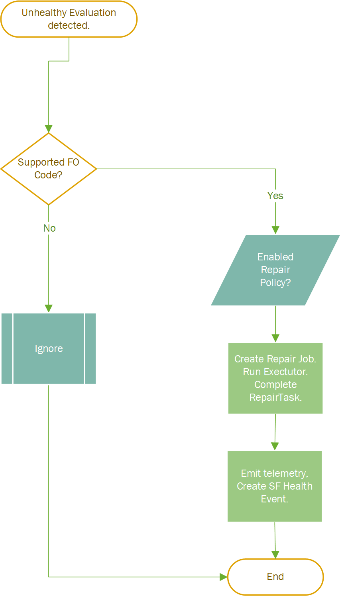

# FabricHealer Beta
### Configuration as logic and auto-mitigation in Service Fabric clusters

FabricHealer is a Serive Fabric application that attempts to fix a set of reliably solvable problems that can take place in a Service Fabric application service or host virtual machine, including logical disks, but scoped to space usage problems only. These repairs mostly employ a set of Service Fabric API calls, but can also be fully custom. All repairs are orchestrated through Service Fabric’s RepairManager service. Repair configuration is written as [Prolog](http://www.learnprolognow.org/)-like logic programming system, [Guan](https://github.com/microsoft/guan). Backing repair implementations - internal predicates - are written in C#.

```
FabricHealer requires that RepairManager service is deployed in the same cluster. 
```

FabricHealer is a stateless singleton (one partition) Service Fabric service that runs on all nodes in a Linux or Windows cluster. It is implemented as a .NET Core 3.1 application and has been tested on Windows (2016/2019) and Ubuntu (16/18.04).  

Its primary purpose is to enable automatic healing in Service Fabric clusters. Repair configurations are written as Prolog-like logic rules where supporting external predicates are written in C#. The fun starts when it detects error or warning health reports generated by [FabricObserver](https://github.com/microsoft/service-fabric-observer) running in the same cluster. 
```
FabricHealer requires that FabricObserver is deployed in the same cluster. 
```
All warnings and error reports created by FabricObserver instances are user-configured. Developer control extends from unhealthy event source (FO) to related healing operations (FH). This is a key part of the design.  

```
This is a beta quality release (in both design and implementation) 
and is not meant nor supported for use production - that will come with learnings from the beta. 
```

## Configuration as Logic
FabricHealer leverages the power of logic programming with Prolog-like semantics/syntax to express repair workflows in configuration. To learn more [click here.](Documentation/LogicWorkflows.md)

## Quickstart

For some examples and to quickly learn how to use FH, please see the [simple scenario-based examples.](Documentation/Using.md)

## High Level FabricHealer Workflow  

 
